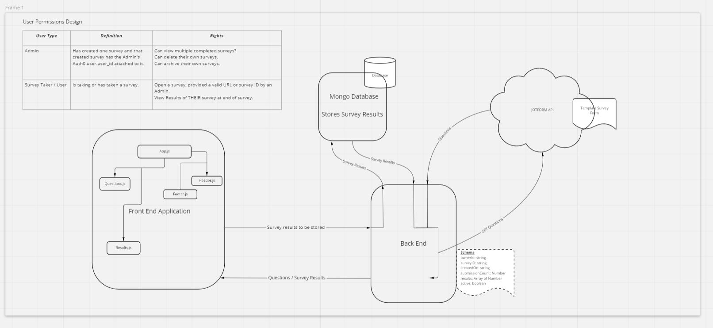
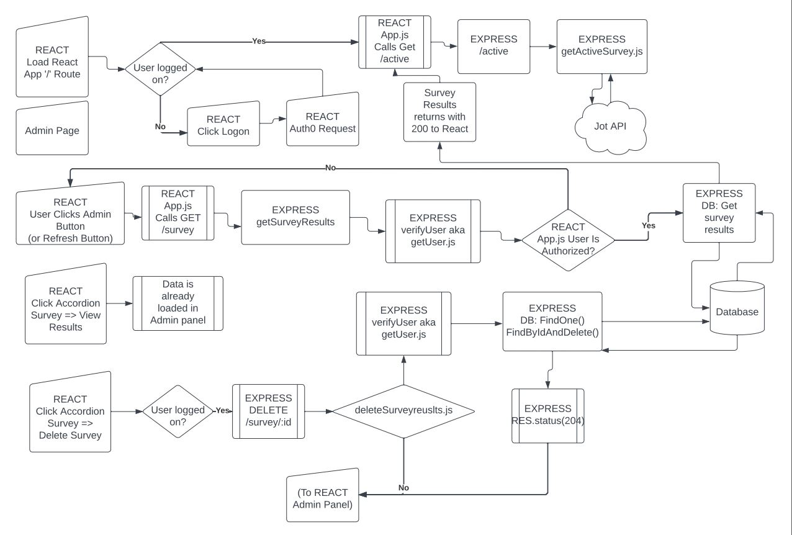

# Tech Perspective Frontend

## Deploy URL

[Frontend Deployment](https://survey-surveyors-backup.netlify.app/)  

## Admin URL

[Administrator Panel](https://survey-surveyors-backup.netlify.app//admin)  

## Public Survey URL

An un-authenticated user can take an Activated Survey [here](https://survey-surveyors-backup.netlify.app/public-survey)  

## The vision


The vision compiling diversity data and using it as a teaching tool to bring to light internal biases and ways to be more conscious with regard to inclusivity and diversity .

## The Problem Domain

This project will revolutionize the existing survey app, making it more user friendly and potentially caching historical data.  

## UI Wire Frame



## Functional Flow Diagram



## The Importance

This SERVEY will improve the awareness of internalized biases, discrimination and privilege based on a multitude of factors.  This APP will serve to enable creating, providing, completing, and reporting on JotForm surveys.  

## The Project Scope

See [requirements.md](./requirements.md)  

### DataBase Schemas

```js

ClassSurvey = {
  ClassNumber : Number,
  Identifier : String,
  ClassCount : Number,
  Instructor : String,
  thumbnail : String, //url
  note: String //optional
}
```

## How To Use In Local

1. Sign up for an Auth0 account and view the documentation on implementing in a React single-page website  
1. Sign up for a JotTemplate API key and review the API documentation  
1. Sign up with MongoDB and deploy a simple database  
1. Clone: `git clone` the frontent repo (this one)  
1. Clone: `git clone` the backend repo [here](https://github.com/Survey-Surveyors/techperspective-back)  
1. Install modules by CD into each repo folder and execute: `npm install`  
1. Update environment variables: Copy hidden file `.env.sample` to `.env` and complete the properties.
1. Install nodemon for a simpler server-side local testing environment: `npm install nodemon`  
1. Use `npm start` to launch the React back end server (or nodemon if installed) first, then React front-end  

### Optional Steps

1. You will need to fork or clone these repos to your own GitHub  
1. Acquire a Netlify account and allow a Netlify App to manage your GH Repo  
1. Acquire an Heroku account and read-up on how to use Heroku-CLI to push and build the backend app  

## Work Plan

### **Tools for collaboration and workflow**

- Trello: board we used to list and check off various tasks.
- GitHub Organization: Collectively edit our work reliably.

### **Git Process**

- Frontend and backend will live on the GitHub
- Making an organization
- Working on own branches
- Push to staging and test
- Otherwise push as needed

### **PR Processes**

- Two other reviews for main
- One for staging
- Merging hopeful once a day but as necessary

### **Credit and Co-Conspirators**

This repo was forked from: [Team Melting Pot Data(https://github.com/Meltingpot-Data)  

*This version was updated by team Survey Serveyors in May of 2020*

Developers:

- Jon Rumsey
- Liesl White
- Simon Son

...with help from Allen Brazier

...under the direction of Brook Riggio, whom we thank for all your help and support during this project!  

Thank you to all past contributers to this tech perspective survey! (*Erik Savage*, *Michael Metcalf*, *Joey Hernandez*, *Emily Landers*, and *Ryan Lee*!)

### **Contact the Team**

[Follow Allen on LinkedIn](linkedin.com/in/allenbrazier)

[Follow Jon on LinkedIn](linkedin.com/in/jonathan-rumsey-wa)

[Follow Liesl on LinkedIn](linkedin.com/in/lieslwhite)

[Follow Simon on LinkedIn](linkedin.com/in/sson68x)
